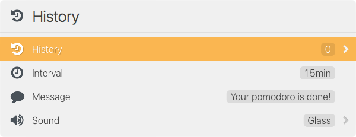

# Pomodoro

Imagine some beautiful prose and pretty pictures and witty, entertaining copy.
Currently doing a pomodoro interval to implement all that and more!

<dl>
  <dt>pomodoro ↩︎</dt>
  <dd>
    Start a default pomodoro. The default message will be shown at the end of
    the interval, and the default interval length will be used.
      
    
  </dd>
  <dt>pomodoro ␣</dt>
  <dd>
    Start a custom pomodoro. You can type in a custom message to show at the end
    of the interval, and you can specify a custom interval length. If you omit
    either, then the default message or interval will be used.
      
    
  </dd>
  <dt>pomodoro ⌘↩︎</dt>
  <dd>
    Show the default pomodoro settings.
      
    
  </dd>
</dl>

