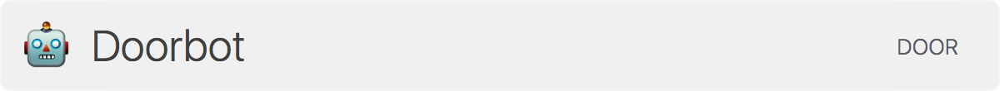
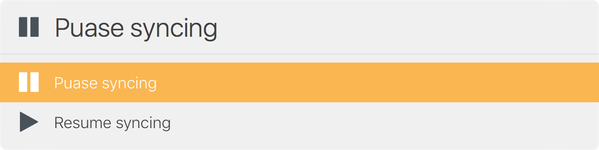
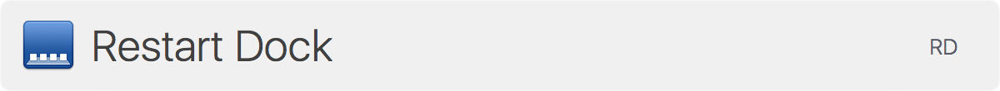

# LaunchBar Actions

A collection of useful LaunchBar actions that I've written and collected from
around the Internet. The list of actions are shown below. There is a section on
[installing](#installing) the actions, and there is another section with [useful
links](#useful-links) to other LaunchBar actions and development resources.

## The Actions

* [Do Not Disturb](#do-not-disturb)
* [Doorbot](#doorbot)
* [Pause Dropbox](#pause-dropbox)
* [Pomodoro](#pomodoro)
* [Restart Dock](#restart-dock)
* [Timer](#timer)
* [VPN Connection](#vpn-connection)
* [Wifi](#wifi)

### Do Not Disturb

An action that enables and disables "Do Not Disturb" for Notifications in MacOS.
This is a simple action that toggles the state of "Do Not Disturb". When "Do Not
Disturb" is disabled the action will turn it on preventing Notifications from
displaying. When enabled, the action will disable "Do Not Disturb" allowing
Notifications to be displayed.


### Doorbot

If you want to unlock the front door to our office, then this is the LaunchBar
action for you. The caveat is that you have to be connected to our private
network in the office. So you cannot unlock the front door while sipping a
Mai-Tai and watching the sunset on Waikīkī beach.



### Pause Dropbox

Everyone loves Dropbox 😍 ... except your network administrator who cries tears
of regret over quitting art school as the switching backbone starts dropping
packets. This action will pause your Dropbox syncing. It relies on the
Accessibility feature of Applescript to automate clicking on the pause and
resume buttons in the Dropbox UI. You will need to grant LaunchBar permission to
use Accessibility for this action to work.




### Pomodoro

Sometimes you need to trick your brain into getting things done. The [pomodoro
technique](https://en.wikipedia.org/wiki/Pomodoro_Technique) is one such method
for getting past the initial block we sometimes face when starting a task.

This is a simple pomodoro timer built inside of LaunchBar. You can configure the
default interval and alert sound. It is all explained in greater detail in the
[readme file](Pomodoro.lbaction/README.md) for the pomodoro action.


### Restart Dock

Do you work from a Mac laptop? Do you plug that laptop into Thunderbolt
displays? Does your Cmd-Tab application switching no longer display on your
monitor? You need to restart your Dock, and this action will do just that.



### Timer

I need to leave in 7 minutes to catch that bus ... 10 minutes go by ... well
poop! Set a timer next time and don't miss that bus. The timer actions uses
LaunchBar's "large type" feature to display your reminder at the appropriate
time along with an alert sound.


### VPN Connection

Connect and disconnect [Viscosity](https://www.sparklabs.com/viscosity/) VPN
connections. The action is smart and detects if a connection is active or
inactive. For active connections, the action will present the option to
disconnect. For inactive connections, the action will present the option to
connect.


### Wifi

Turn the wireless network on and off.


## Installing

These LaunchBar actions cannot be found by LaunchBar when they are tucked away
here in the dotfiles repository. We need to copy the `*.lbaction` folders to the
`~/Library/Application Support/LaunchBar/Actions` folder. This is where
LaunchBar looks for custom actions.

We also need to compile all the `*.applescript` files into binary `*.scpt` files
that LaunchBar can execute. The applescript files are great for humans and `git`
version control, but they are not so great for LaunchBar. We can use the
`osacompile` command to compile the `*.applescript` files into `*.scpt` file
equivalents. Then we can copy the `*.lbaction` folders to the correct location.

There is a rake task for performing all these steps:

```sh
rake launchbar:install
```

## Useful Links

**Documentation**

* [LaunchBar Developer Reference](https://developer.obdev.at/launchbar-developer-documentation/#/welcome)
* [Font Awesome Icons](http://fontawesome.io/icons/)

**Developer Actions**

* [prenagha/launchbar](https://github.com/prenagha/launchbar)
* [atika/launchbar](https://github.com/atika/launchbar)
* [hlissner/lb6-actions](https://github.com/hlissner/lb6-actions)
* [Ptujec/LaunchBar](https://github.com/Ptujec/LaunchBar)
* [Duhemm/launchbar-github](https://github.com/Duhemm/launchbar-github)
* [Nicholas Riley LaunchBar Actions](https://sabi.net/nriley/software/#launchbar)

